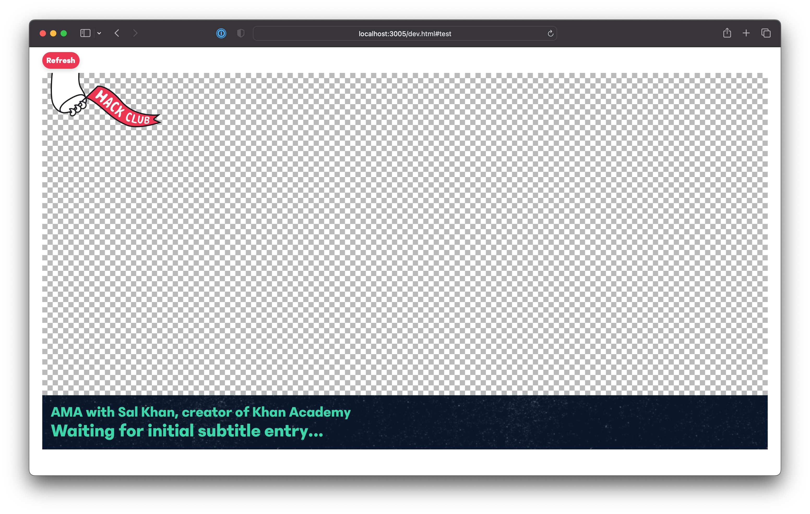

# AMA Livestream overlay

This is a simple webpage used as an [OBS](https://github.com/obsproject/obs-studio) overlay for our AMA with Sal Khan.

## Development

Most pages will work by just statically loading them from the `/public` folder into your browser. We're using an express server (started with `npm i; npm run start`) to control the stream page remotely because OBS doesn't allow keyboard or mouse input to pages used as overlays.

## Contributing

Contributions are encouraged and welcome! Feel free to submit a pull request with code changes, or open issues for suggestions or bug reports.

Development chatter happens in the [#sal-khan-ama-stream-team](https://app.slack.com/client/T0266FRGM/C047RMVFMBP) channel in the [Hack Club Slack](https://hackclub.com/slack/).
